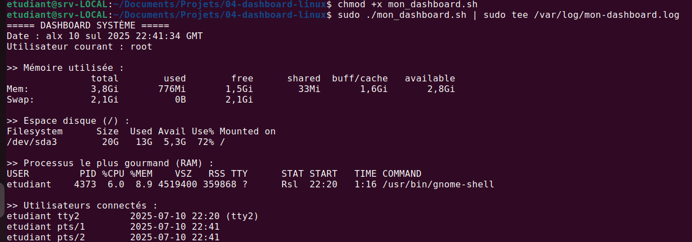

---

## 📄 4. Contenu du `portfolio-projets.md`

```markdown
# 📊 Projet 04 – Dashboard système Linux

### 📝 Description :
Un script Bash qui collecte des informations système utiles (mémoire, disque, processus, utilisateurs) et les journalise automatiquement.

### 🖼️ Image :


### 🎞️ GIF démonstration :


### 🎥 Vidéo :
 [Voir la vidéo](https://drive.google.com/...)

### 🔗 Lien GitHub :
[https://github.com/tbyb/dashboard-linux-bash](https://github.com/tbyb/dashboar-linux)

### 🛠️ Technologies utilisées :
- Bash
- df, free, ps, who, tee
- journalctl
